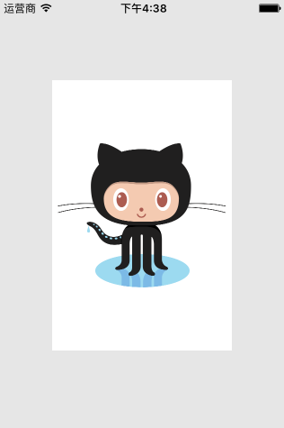

# UIImageView_YJ

[](https://travis-ci.org/huang-kun/UIImageView_YJ)
[](http://cocoapods.org/pods/UIImageView_YJ)
[](http://cocoapods.org/pods/UIImageView_YJ)
[](http://cocoapods.org/pods/UIImageView_YJ)

## Usage

#### UIViewContentMode

When you display an image in a UIImageView. The UIViewContentMode decides the rule of displaying. 

e.g. To make the image scale aspect fit in the imageView, just set UIImageView's contentMode property to `UIViewContentModeScaleAspectFit`.

```
imageView.contentMode = UIViewContentModeScaleAspectFit;
```



To make the image align top of the imageView, just set UIImageView's contentMode property to `UIViewContentModeTop`. (The image itself is big!)

```
imageView.contentMode = UIViewContentModeTop;
```


However, what if you would like to make it both fit in the imageView and then align top ? Obviously There is no option like `UIViewContentModeScaleAspectFitTop` provided by the UIViewContentMode enum type.

<br>

#### YJViewContentMode

This is a new enum type defined by `NS_OPTIONS` macro. To achieve both fit and align top effect, just set it's `yj_contentMode` property:

```
imageView.yj_contentMode = YJViewContentModeScaleAspectFit | YJViewContentModeTop;
```

Write one line of code, you get the result like this:


There are a lot of combinations you can specify like (Fit | Top | Left). Once your combinations encounter the conflict, e.g. (Fit | Fill) or (Top | bottom), it automatically filtering the result by giving up some of the options.

<br>

## Requirements

ARC enabled

## Installation

UIImageView_YJ is available through [CocoaPods](http://cocoapods.org). To install
it, simply add the following line to your Podfile:

```ruby
pod "UIImageView_YJ"
```

## Author

huang-kun, jack-huang-developer@foxmail.com

## License

UIImageView_YJ is available under the MIT license. See the LICENSE file for more info.


